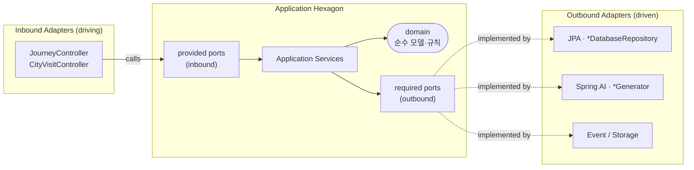
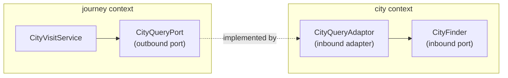

# TravelDiary API

여행(Journey) · 도시 방문(CityVisit) · 게시글(Post)을 기록하는 REST API

---

## Architecture — Hexagonal (Ports & Adapters)

### 의존 방향

```
adaptor  ──▶  application (port)  ──▶  domain
```

- **domain** 은 아무것도 의존하지 않는다 (프레임워크 애노테이션 없음).
- 프레임워크(JPA · Web · AI · Security)는 전부 **adaptor** 로 밀어낸다.
- application 은 인터페이스(port)로만 바깥과 소통하고, 구현체(adaptor)는 런타임에 주입된다.

### 포트/어댑터 명명 규약

| 레이어 | 패키지 | 역할 |
|--------|--------|------|
| Domain | `domain/` | 순수 도메인 모델·비즈니스 규칙 |
| **Inbound Port** (driving) | `application/provided/` | 애플리케이션이 **제공**하는 유스케이스 인터페이스 |
| Application Service | `application/` | 유스케이스 구현 — `provided` 구현, `required` 사용 |
| **Outbound Port** (driven) | `application/required/` | 애플리케이션이 **요구**하는 인터페이스 (DB·AI·타 컨텍스트) |
| Inbound Adapter | `adaptor/controller/`, `adaptor/inbound/` | REST 컨트롤러 등 — `provided` 포트 호출 |
| Outbound Adapter | `adaptor/infrastructure/`, `adaptor/ai/`, `adaptor/event/` | `required` 포트 구현 |

### 전체 구조



---

## Bounded Contexts

| 컨텍스트 | 책임 |
|----------|------|
| `city/`    | 도시 마스터 데이터, AI 설명·이미지 비동기 생성 |
| `journey/` | 여행(Journey) + 도시 방문(CityVisit) |
| `post/`    | 방문지 게시글(Post) |
| `shared/`  | 공용 VO(`Coordinate`), 보안(JWT, `@AccessMemberId`) |

컨텍스트 간 결합은 **포트 경계에 가둔다**. journey 는 city 를 ID로만 참조하고, 도시 조회는 포트를 통한다:



---

## 도메인 ↔ 엔티티 매핑

- `domain/` 모델은 순수하다 (JPA 애노테이션 없음).
- JPA 엔티티(`JourneyEntity`, `CityEntity` …)는 adaptor 에 있고 `from(domain)` / `toDomain()` 매퍼를 갖는다.
- **Repository 어댑터는 항상 도메인 객체를 반환**한다 (managed 엔티티 비노출). 따라서 영속 변경은 명시적 `save()` 로 반영한다.
- 값 객체(VO)는 `@Embeddable` 로 매핑한다 (`Coordinate`, `CityDescription`, `PlacePoint`).
